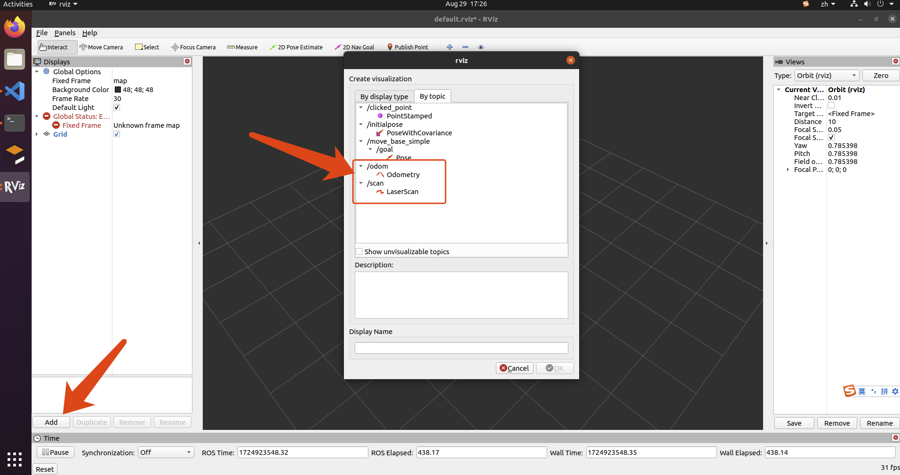
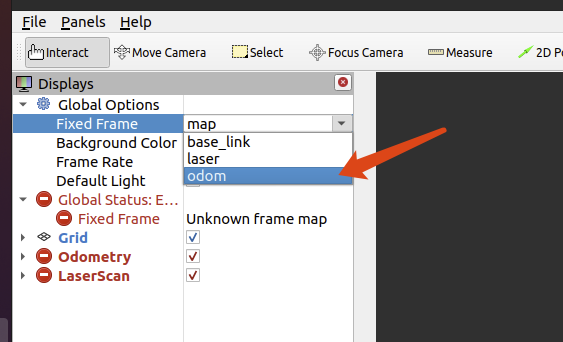
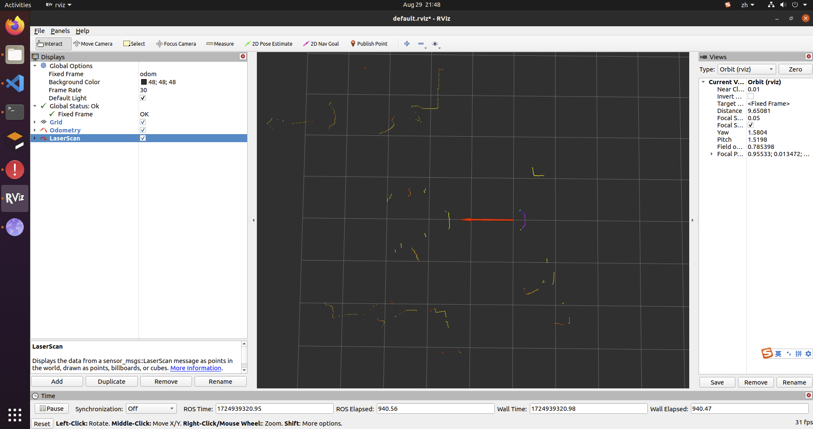

### 2.机器人底盘数据
>机器人的底盘运行相关代码在[cvte_robot_bringup](../cvte_robot_bringup/),主要用于和机器人MCU建立通信，获取底层硬件传感器数据，运行底盘控制接口等功能。

cvte_robot_bringup包括如下功能包：
+ 1.[cvte_robot_base](../cvte_robot_bringup/cvte_robot_base/):读取编码器数值，根据双轮差速模型计算出里程计数据并发布，同时还会发布雷达与轮子的tf关系
+ 2.[rplidar_ros](../cvte_robot_bringup/rplidar_ros/):雷达的官方驱动
+ 3.rosserial_python:ros1官方自带软件包，用于与机器人mcu的通信，从而具备获取编码器数据，控制机器人运动，控制清洁组件等功能
+ 3.[cvte_robot_bringup](../cvte_robot_bringup/cvte_robot_bringup/):启动上述功能包的launch脚本，并传递对应的硬件参数

在此之前请确保完成[代码的编译](./1.%E7%8E%AF%E5%A2%83%E6%90%AD%E5%BB%BA%E4%B8%8E%E7%BC%96%E8%AF%91.md)
##### 1.启动roscore
```
# 在机器人终端运行
source /opt/ros/noetic/setup.bash
roscore
```

##### 2.启动cvte_robot_bringup
```
# 另启一个机器人终端运行
cd /oem/robot
export ROS_MASTER_URI=http://10.153.151.1:11311
export ROS_IP=10.153.151.1
source devel/setup.bash
roslaunch cvte_robot_bringup bringup.launch
```

##### 3.遥控机器人
遥控机器人前，请先确保机器人不是处于急停状态（机器人指示灯非红灯快闪状态）。急停解除请参照[机器人基本介绍](0.%E6%9C%BA%E5%99%A8%E4%BA%BA%E5%9F%BA%E6%9C%AC%E4%BB%8B%E7%BB%8D.md)
```
# 另启一个机器人终端运行
source /opt/ros/noetic/setup.bash
rosrun teleop_twist_keyboard teleop_twist_keyboard.py
```
按下键盘jkl,键，即可控制机器人前后移动，和顺时针逆时针自旋。


##### 4.查看底盘数据
在此之前，您需要确认PC的IP地址，在PC终端输入ifconfig命令，确认您和机器人连接的网卡，一般为wlan0。输入后可能在终端出现如下的信息：
```
wlan0: flags=4163<UP,BROADCAST,RUNNING,MULTICAST>  mtu 1500
        inet 10.153.151.170  netmask 255.255.255.0  broadcast 10.153.151.255
        inet6 fe80::b457:aab8:55e1:cfb5  prefixlen 64  scopeid 0x20<link>
        ether 00:1c:42:d7:41:1c  txqueuelen 1000  (Ethernet)
        RX packets 1307602  bytes 324696210 (324.6 MB)
        RX errors 0  dropped 4796  overruns 0  frame 0
        TX packets 680935  bytes 93563140 (93.5 MB)
        TX errors 0  dropped 0 overruns 0  carrier 0  collisions 0

```
其中inet 10.153.151.170就是PC的IP地址，将下列命令中的${IP}替换为PC的IP地址

```
# 在PC终端执行
export ROS_MASTER_URI=http://10.153.151.1:11311
export ROS_IP=${IP}
export ROS_HOSTNAME=${IP}
source /opt/ros/noetic/setup.bash
rviz
```

运行后添加odom与laser数据的显示  

修改fixed frame为odom   
   
可以同时看到里程计数据（红色箭头）与雷达数据（红色点云），则表示bringup启动成功      

