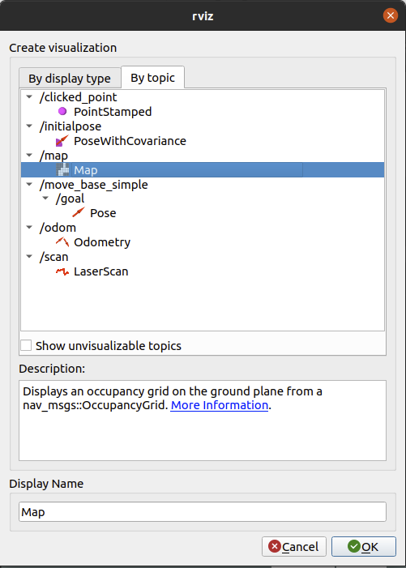
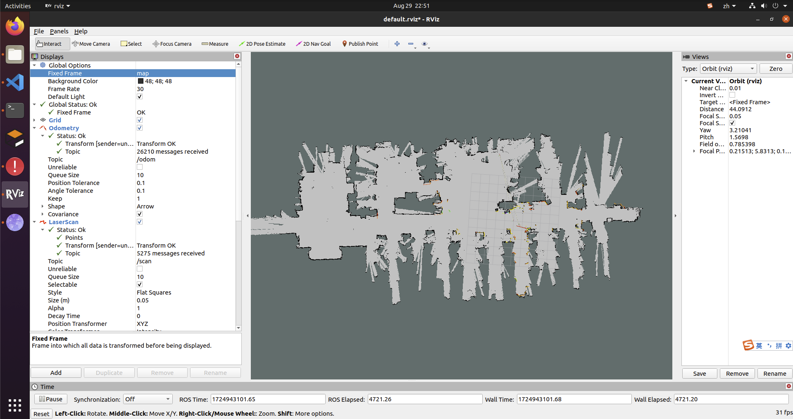

### 3.构建地图
>构建地图前，请先确认[机器人底盘数据](./2.%E6%9C%BA%E5%99%A8%E4%BA%BA%E5%BA%95%E7%9B%98%E8%BF%90%E8%A1%8C.md)已经正常运行
>SLAM（同步定位与地图构建）是一种通过估计任意空间中的当前位置来绘制地图的技术。cvte_robot_slam中是使用gmapping包来进行构图。

##### 1.运行slam节点
```
# 在机器人终端运行
cd /oem/robot
source devel/setup.bash
roslaunch cvte_robot_slam cvte_robot_gmapping.launch
```

##### 2.运行rviz
参照[机器人底盘数据](./2.%E6%9C%BA%E5%99%A8%E4%BA%BA%E5%BA%95%E7%9B%98%E8%BF%90%E8%A1%8C.md)正确运行rviz

##### 3.添加map的订阅


##### 5.启动遥控器，遥控机器人进行探索
```
# 在机器人终端运行
source /opt/ros/noetic/setup.bash
rosrun teleop_twist_keyboard teleop_twist_keyboard.py
```
遥控机器人完成对所需区域的探索。



##### 6.保存地图
其中-f表示机器人保存地图的路径，你可以根据自己需求修改这个参数
```
# 在机器人终端运行
source /opt/ros/noetic/setup.bash
rosrun map_server map_saver -f /userdata/map
```

看到类似如下的打印，则表示保存成功
```
[ INFO] [1724943176.102786394]: Waiting for the map
[ INFO] [1724943176.347613394]: Received a 864 X 1088 map @ 0.050 m/pix
[ INFO] [1724943176.347762144]: Writing map occupancy data to /userdata/map.pgm
[ INFO] [1724943176.404361228]: Writing map occupancy data to /userdata/map.yaml
[ INFO] [1724943176.404888853]: Done

```

##### 7.退出构图程序
保存地图后，cvte_robot_slam程序就完成他的工作，切回运行cvte_robot_slam的终端，按ctrl+c退出程序。