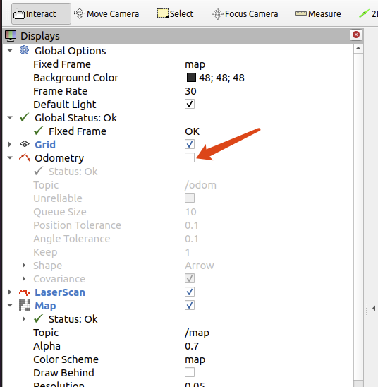
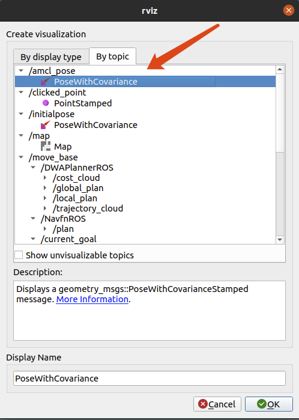
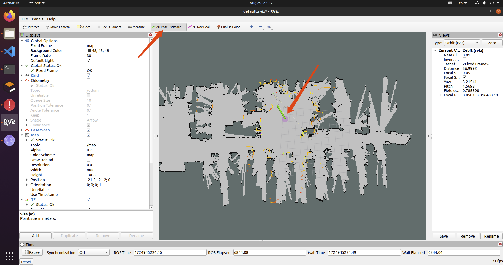
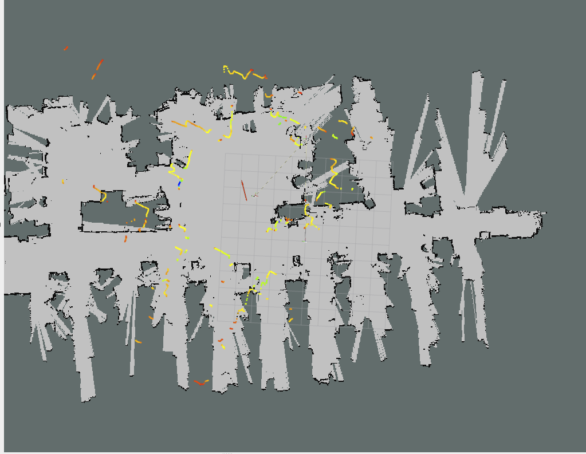
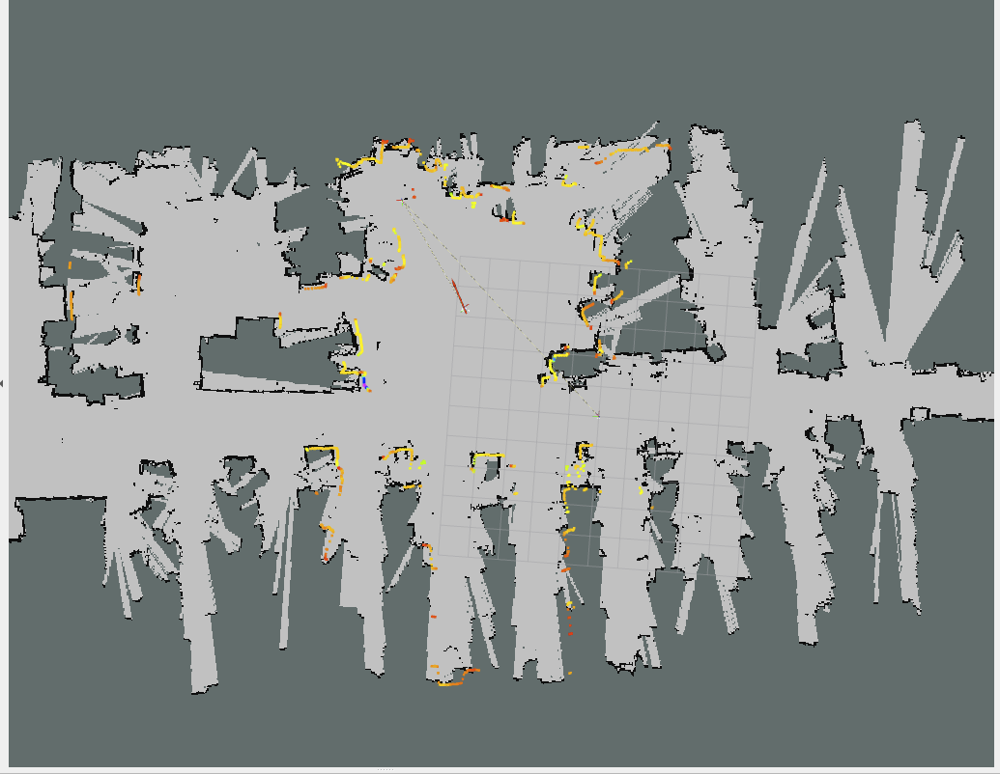
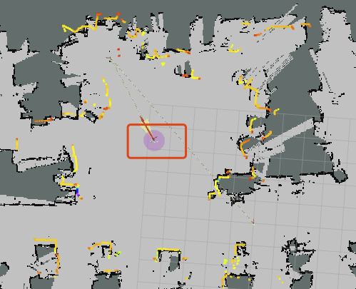
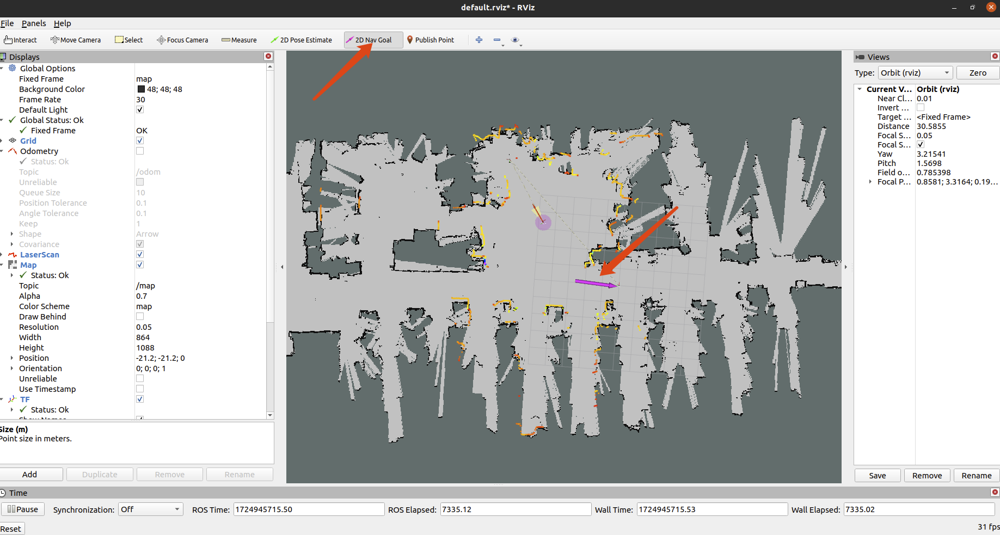

### 4.机器人导航
有了地图之后，即可让机器人自动从地图中的一个位置移动到指定目的地。如上一节描述，我们已经构建好了一张地图。

###### 1.启动cvte_robot_navigation
在这里我们需要将上一节构建好的地图通过参数map_file传递给cvte_robot_navigation，你可以根据自己实际地图保存位置和名字填写参数。
```
roslaunch cvte_robot_navigation cvte_robot_navigation.launch map_file:=/userdata/map.yaml
```

###### 2.设置机器人初始位置
刚开始的时候机器人是不知道自己所处位置，需要我们将它的实际位置告诉他。
+ 将Global Options中的Fixed Frame设置为map
+ 先关闭odom数据的显示，取消选中即可  

+ 新增amcl_pose的订阅   

+ 点击2D Pose Estimate，将机器人当前所在实际位置在地图中标记出来   

+ 确认激光点与地图轮廓大致吻合  


不吻合的情况   

吻合的情况   


大致吻合即可，机器人开始运动后会自动纠正误差
如图所示，设置定位后有个粉红的圆圈，圆圈越大表明定位精度越差。如果定位无误，机器运动起来后，这个圆圈应当逐渐变小。   


###### 4.设置机器人目标位置

点击2D Nav Goal，再点击地图上的期望机器人前往的位置，之后机器人就会自动规划最优路线，走到目标点。行走过程中如果遇到障碍物，机器人会自动重新规划路线进行避让。
